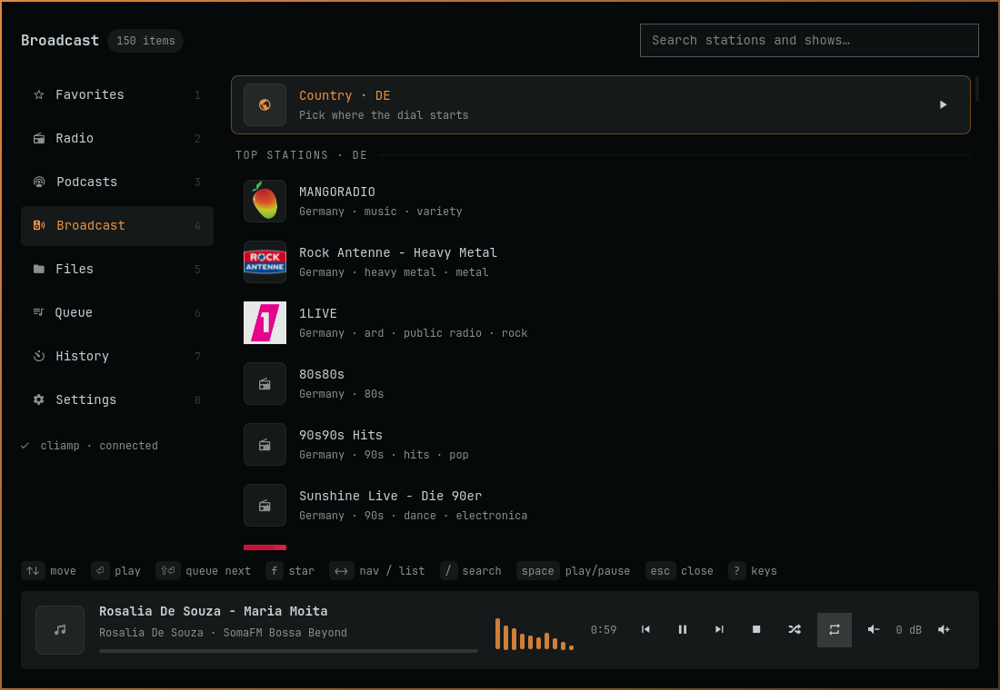
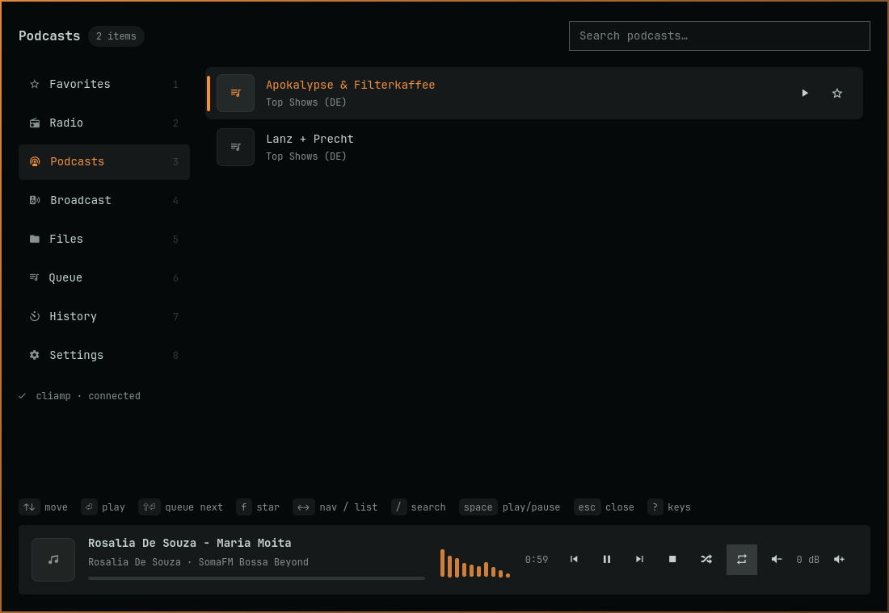
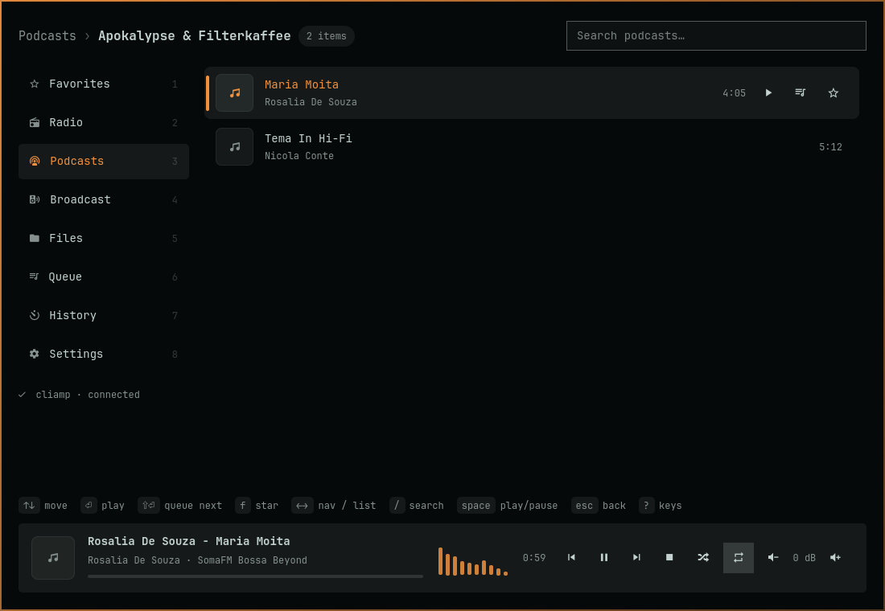
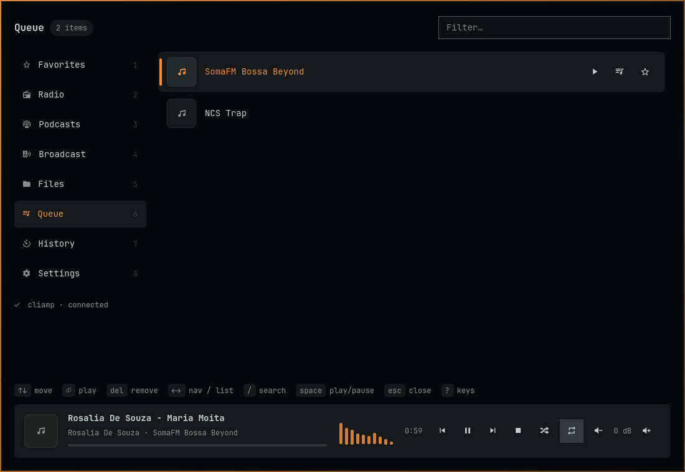
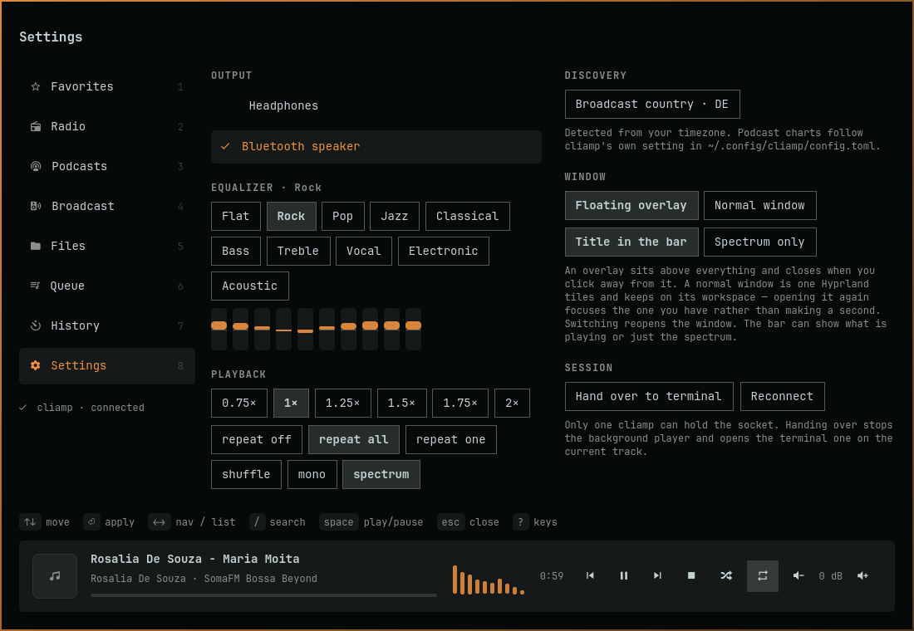
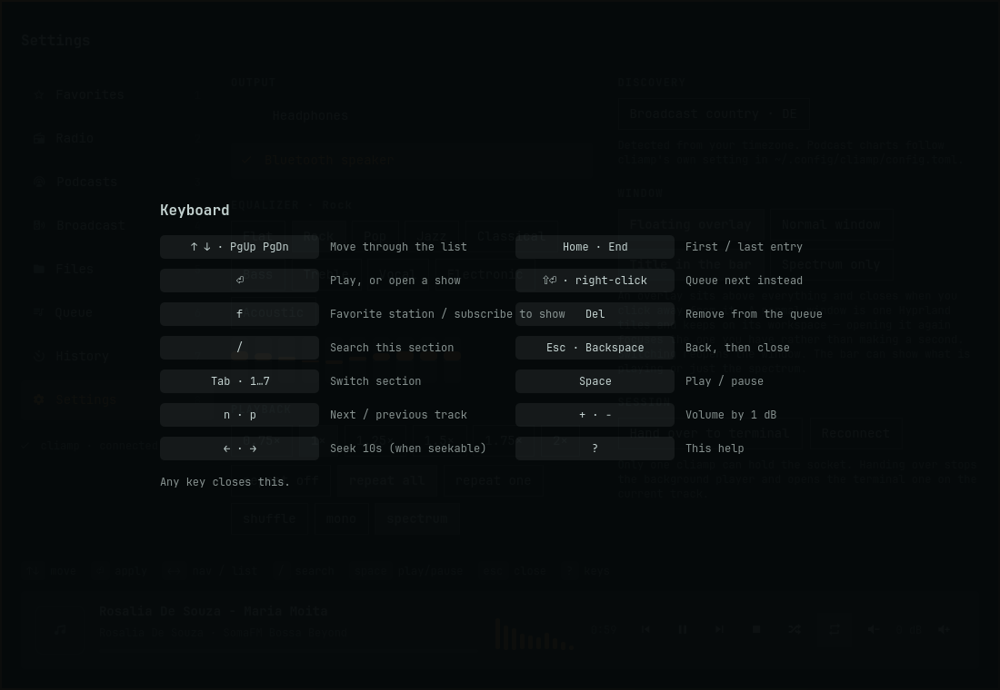
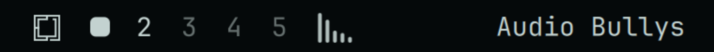

# cliamp for Omarchy

A window for [cliamp](https://github.com/bjarneo/cliamp), the retro terminal
music player, and a bar widget that shows what it is playing — with cliamp's own
spectrum drawn in the bar.

The plugin does not play anything itself. cliamp is the engine; this is a second
face for it, over cliamp's v2 IPC. The terminal player and this window are two
views of one instance, so pausing here pauses there.



<table>
<tr>
<td></td>
<td></td>
</tr>
<tr>
<td></td>
<td></td>
</tr>
</table>



In the bar, playing and paused — the same five bars, morphed:




## What it does

- **Bar widget** — the track title, scrolling, with cliamp's spectrum beside it.
  Paused morphs the spectrum into a pause glyph rather than swapping in a
  different icon. Click opens the library; middle-click skips; the wheel moves
  through the queue; right-click keeps the small MPRIS popup.
- **Library window** — radio, podcasts, live radio worldwide, your files, the
  queue, history, settings. Keyboard-first, mouse-complete, with a breadcrumb
  that says where a drilled-in list came from and gets you back in one click.
- **Broadcast, wherever you are** — live stations for your country via the
  [Radio Browser](https://www.radio-browser.info/) directory, with the country
  detected from your timezone and switchable in the list. Where a public
  broadcaster publishes a catalogue of its own, an adapter adds it on top; the
  ARD Audiothek (Germany) is the first, with its live streams, its topics and
  its programmes.
- **Stars** — anything is starrable, including things cliamp has no favorite for
  (an ARD programme, a Radio Browser stream, a single episode). Stars live in
  `~/.local/state/omarchy/cliamp-media/favorites.json`. Starring something cliamp
  *does* know — a station, a podcast show — also toggles cliamp's own favorite,
  so the TUI agrees.
- **Works with no terminal open** — if cliamp is not running when you ask for
  something, the plugin starts it headless (`cliamp --daemon`) and says so once.

## Requires

- **[cliamp](https://github.com/bjarneo/cliamp)** — the player this drives.
  Omarchy installs it as part of its base packages, so on a stock system there
  is nothing to install. Elsewhere: `omarchy pkg add cliamp`, or the AUR.
  Nothing here plays audio on its own.
- **Quickshell**, which Omarchy already ships as its shell.
- **Network access**, for the Broadcast section only: it reads
  [Radio Browser](https://www.radio-browser.info/) and, in Germany, the
  [ARD Audiothek](https://api.ardaudiothek.de). Radio, Podcasts, Files, Queue
  and History go through cliamp and talk to nothing else.

No account, no API key, no configuration file of its own beyond the stars it
writes to `~/.local/state/omarchy/cliamp-media/favorites.json`.

## Install

```sh
omarchy plugin add https://github.com/janrenz/omarchy-cliamp --enable
```

`--enable` puts the widget in the bar's left section. Without it, enable the
widget later from `omarchy menu plugin` or with
`omarchy plugin enable janrenz.omarchy.cliamp --section left`.

## Remove

```sh
omarchy plugin remove janrenz.omarchy.cliamp
```

That takes the widget out of the bar and deletes the plugin. Two things outlive
it, both on purpose and both yours to delete:

```sh
rm -rf ~/.local/state/omarchy/cliamp-media   # the stars
pkill -f '^cliamp --daemon'                  # a background player it started
```

cliamp itself is a separate package and is left alone — `omarchy pkg remove
cliamp` if you want that gone too. The plugin never edits your `shell.json`
beyond the widget entry that `omarchy plugin enable` and `remove` manage.

## Keys

| Key | Does |
| --- | --- |
| `↑` `↓` `PgUp` `PgDn` `Home` `End` | Move through the list, never onto a section header |
| `←` `→` | Leave the list for the sidebar, and come back |
| `⏎` | Play, or open a show |
| `⇧⏎`, right-click | Queue next instead |
| `f` | Star, or unstar |
| `Del` | Remove from the queue |
| `/` | Search this section |
| `Esc`, `Backspace` | Back one level, then close |
| `Tab`, `1`…`8` | Switch section |
| `Space` · `n` · `p` | Play/pause · next · previous |
| `+` `−` | Volume, by 1 dB |
| `Ctrl+←` `Ctrl+→` | Seek 10s, where the source can seek |
| `?` | Every key, in the window |

## Overlay or window

By default the library is a floating overlay: it sits above everything and
closes when you click away from it. Settings → **Window** switches it to an
ordinary window instead — one Hyprland tiles, keeps on its workspace, and leaves
open beside your terminal. In that shape, clicking the bar widget again focuses
the window you already have rather than opening a second one.

## One socket

Only one cliamp can hold its socket. If the plugin started a background player
and you then run `cliamp` in a terminal, that second instance runs blind beside
the first — same as any two cliamps. Settings → **Hand over to terminal** stops
the background player and opens the terminal one on the current track.

## Developing

```sh
dev/test.sh           # the tests
dev/run.sh            # the window, on fixtures, in a harness of its own
dev/shot.sh out.png   # photograph what the harness is drawing
dev/showcase.sh       # regenerate every screenshot in this file
dev/shot-bar.sh       # the two bar states, from the real bar
```

See [AGENTS.md](AGENTS.md) for how it is put together.

## Licence

MIT — see [LICENSE](LICENSE).
